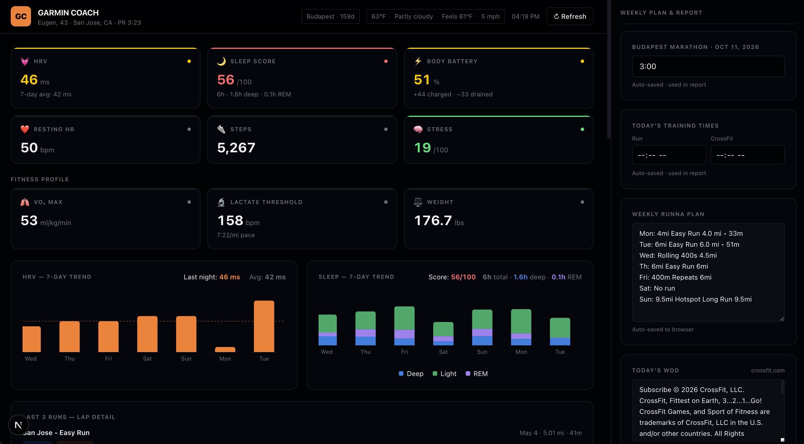

# 360 Fitness Coach

A personal training dashboard for marathon runners. Pulls live data from Garmin Connect and combines it with weather, CrossFit WOD.




---

## Features

- **Garmin dashboard** — live sync of HRV, sleep, Body Battery, resting HR, steps, stress, VO2 max, and lactate threshold
- **Activity feed** — recent runs with per-lap breakdowns, pace, HR, and recovery time
- **Weekly mileage chart** — rolling 6-week training load
- **HRV & sleep charts** — trend visualization over time
- **Local weather** — current conditions for San Jose, CA (temp, humidity, wind, UV index)
- **CrossFit WOD** — daily workout scraped from crossfit.com

---

## Tech Stack

- [Next.js 16](https://nextjs.org/) (App Router)
- [React 19](https://react.dev/)
- [Tailwind CSS v4](https://tailwindcss.com/)
- [shadcn/ui](https://ui.shadcn.com/) components
- [Recharts](https://recharts.org/) for data visualization
- [garmin-connect](https://github.com/cyberjunky/python-garminconnect) Node.js client
- [Open-Meteo](https://open-meteo.com/) for weather (free, no key required)

---

## Getting Started

### 1. Clone and install

```bash
git clone https://github.com/taracila/360FitnessCoach.git
cd 360FitnessCoach
npm install
```

### 2. Configure environment variables

```bash
cp .env.local.example .env.local
```

Edit `.env.local` with your credentials:

| Variable | Description |
|---|---|
| `GARMIN_USERNAME` | Your Garmin Connect email |
| `GARMIN_PASSWORD` | Your Garmin Connect password |

### 3. Run the dev server

```bash
npm run dev
```

Open [http://localhost:3000](http://localhost:3000).

---

## API Routes

| Route | Method | Description |
|---|---|---|
| `/api/dashboard` | GET | Fetches and returns all Garmin data |
| `/api/weather` | GET | Local weather + Budapest race-day forecast |
| `/api/wod` | GET | CrossFit WOD for today |
| `/api/generate-report` | POST | Builds the Gemini prompt from dashboard data |
| `/api/ask` | POST | Sends a prompt to Gemini and returns the answer |
| `/api/login` | POST | Authenticates a Garmin session |

---

## Notes

- Garmin sessions are cached to `.garmin-session` (gitignored) to avoid re-authenticating on every request.
- Weather forecasts use imperial units throughout (°F, mph, inches).
